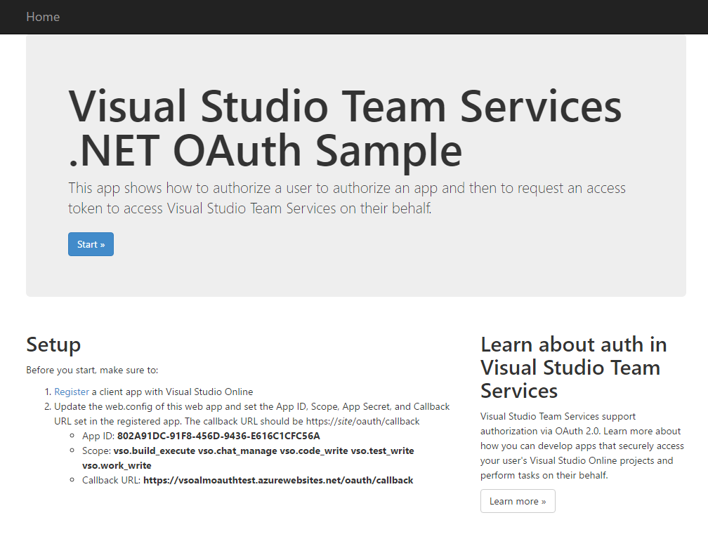

# ASP.NET web app (VSTS OAuth sample)

This sample shows how to prompt a user to authorize a cloud service that can call APIs on Visual Studio Team Services on behalf of the user.

To learn more about OAuth in Visual Studio Team Services, see [Authorize access to VSTS with OAuth 2.0](https://docs.microsoft.com/vsts/integrate/get-started/authentication/oauth?view=vsts)

## How to setup

> These instructions assume you will be deploying this sample app to an Azure web app. To learn more and to get started, visit [Get started with Azure Web Apps and ASP.NET](https://docs.microsoft.com/azure/app-service/app-service-web-get-started-dotnet-framework).

1. Register an OAuth client app in Visual Studio Team Services (https://app.vsaex.visualstudio.com/app/register) 
   * The callback URL should be https://yoursite.azurewebsites.net/oauth/callback, where `yoursite` is the name of your Azure web app

2. Clone this repository and open the solution `OAuthWebSample\OAuthWebSample.sln` in Visual Studio 2015 or later

3. Update the following settings in web.config to match the values in the app you just registered:
   *  `ClientAppID`
   *  `ClientAppSecret` (use the "Client Secret" shown on the VSTS Application Settings page, not the App Secret)
   *  `Scope` (space separated)
   *  `CallbackUrl`

4. Build the solution (this will trigger a NuGet package restore, which will pull in all dependencies of the project)

5. Publish the app to Azure

### Run the sample

1. Navigate to your app (https://yoursite.azurewebsites.net)

2. Confirm your App ID, scope, and callback URL are displayed properly
    

3. Click **Authorize**

4. Sign in to Visual Studio Team Services (if prompted)

5. Review and accept the authorization request

If everything is setup properly, Visual Studio Team Services will issue an access token and refresh token and both values will be displayed. **You should keep these values secret**. Also a new authorization will appear in [your profile page](https://app.vssps.visualstudio.com/Profile/View).

With the access token you can invoke [Visual Studio Team Services REST APIs](https://www.visualstudio.com/docs/integrate/api/overview) by providing the access token in the Authorization header.

```
Authorization: Bearer {access token}
```
